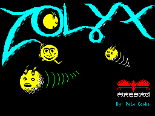

# Zolyx



**[Play Zolyx in your browser](https://arttu76.github.io/zolyx/dist/index.html)** | [GitHub repo](https://github.com/arttu76/zolyx) | [Annotated disassembly by AI](https://github.com/arttu76/zolyx/tree/main/disassembly)

AI-generated reverse engineering and autoconversion of the ZX Spectrum game *Zolyx* (Pete Cooke, Firebird Software, 1987) from a raw 48K Spectrum binary dump to fully documented, strongly-typed TypeScript.

The entire reverse engineering process — disassembly analysis, game mechanic documentation, and TypeScript reimplementation — was performed by AI (Claude) from nothing but the original `zolyx.sna` snapshot file.

## What Is Zolyx?

Zolyx is a Qix-like game where the player:

1. Moves along the border of a rectangular field
2. Presses fire to enter empty space and draw a trail
3. When the trail reaches the opposite border, the area on one side is flood-filled
4. Goal: claim at least 75% of the field area while avoiding enemies

### Enemies

- **Chasers** (1--2): follow the border using a wall-following algorithm
- **Sparks** (1--8): bounce diagonally through empty space
- **Trail Cursor**: activates after 72 frames of drawing, chases along the trail from behind

### Key Constants

- Field bounds: X in [2, 125], Y in [18, 93]
- Interior: X in [3, 124], Y in [19, 92] -> 122 x 74 = 9028 cells
- Win condition: >= 75% claimed
- Lives: 3 per game
- Timer: 176 ticks, decrement every 14 frames (~49s at 50fps)
- Spark kill bonus: +50 points

## Playing

```
npm install
npm run build
# Open dist/index.html in a browser
```

**Controls (keyboard):**
- **Arrow keys** = Move
- **Space** = Fire (start drawing / slow mode while drawing)
- **P** = Pause
- **Enter** = Start game

**Controls (mobile):** Touch controls appear automatically on touch devices — D-pad, Fire, Pause, and Restart buttons.

## Project Structure

```
zolyx/
  resources/
    loading-screen.png            Title screen converted from .scr format
    zolyx.sna                     Original ZX Spectrum 48K snapshot (49179 bytes)
  src/
    index.html                    HTML entry point (CSS + canvas + module script)
    main.ts                       Entry point: canvas setup, input, game loop
    types.ts                      TypeScript interfaces and type aliases
    constants.ts                  All game constants, direction tables, level config
    state.ts                      Shared mutable game state (single exported object)
    screen.ts                     Screen bitmap/attribute buffers, canvas management
    grid.ts                       Grid cell read/write operations
    input.ts                      Keyboard event listeners, input bit encoding
    touch.ts                      Mobile touch controls, multi-touch tracking
    scoring.ts                    Cell counting, percentage calculation, score display
    init.ts                       Game/level initialization, entity spawning, PRNG
    player.ts                     Player movement, drawing mode, trail recording
    fill.ts                       Flood fill algorithm and direction determination
    chaser.ts                     Chaser wall-following movement
    spark.ts                      Spark diagonal movement and bouncing
    trail-cursor.ts               Trail cursor activation and movement
    collision.ts                  Player-entity and trail collision detection
    game-loop.ts                  Per-frame game logic, death/level-complete handling
    data/
      fonts.ts                    Game font ($F700), HUD font ($FA00), character map
      sprites.ts                  8x8 masked sprite data (player, chaser, cursor)
    rendering/
      primitives.ts               Pixel operations: set, XOR, fill rect
      attributes.ts               Attribute color system: set, make, fill runs/rows
      text.ts                     Text rendering: game font, HUD font, centered text
      sprites.ts                  Masked sprite drawing, spark cell rendering
      scene.ts                    Full scene composition: grid, entities, HUD, screens
      blit.ts                     Final blit from internal buffers to canvas
  disassembly/                    Complete Z80 disassembly of original binary
    index.asm                     Memory map and file index
    main_loop.asm                 Main game loop & level complete
    player_movement.asm           Player movement & drawing
    chaser.asm                    Chaser wall-following
    spark.asm                     Spark diagonal movement
    ...                           (19 files total)
  dist/                           Build output (committed, served by GitHub Pages)
    index.html                    Single self-contained file with inlined JS
  vite.config.js                  Vite build configuration
  package.json
  tsconfig.json
  .gitignore
```

## Build Scripts

| Command | Description |
|---------|-------------|
| `npm run build` | Production build: minified, single `dist/index.html` |
| `npm run dev` | Dev server with hot module replacement |
| `npm run typecheck` | TypeScript type checking (`tsc --noEmit`) |

The build uses **Vite** with `vite-plugin-singlefile` to bundle all TypeScript and inline it into the HTML, producing a single self-contained `dist/index.html`.

## TypeScript Architecture

### Design Decisions

**Single state object** (`state.ts`): All mutable game state lives in a single exported `const state = { ... }` object. Every module imports `state` and mutates it directly (e.g. `state.score += 50`). This avoids the ES module limitation where `export let` variables cannot be reassigned from importing modules — only the declaring module can write to them.

**No const enums**: esbuild with `isolatedModules` (required by the bundler module resolution) does not support `const enum`. All game constants are plain `export const` values in `constants.ts`.

**Grid as simple 2D array**: The original Z80 uses packed 2-bit cells in screen memory. The TypeScript version uses `number[][]` (128x128) where each cell is simply 0-3. This eliminates all the bit-packing/masking complexity.

**No shadow grid**: The original Z80 maintains two copies of the screen bitmap — the real one at $4000 and a "shadow" at $6000 where trail cells appear as empty. In TypeScript, this is handled by treating trail as empty in the movement logic of sparks and chasers (they check `cell !== CELL_BORDER && cell !== CELL_CLAIMED` to decide if they can enter a cell).

**Full-screen redraw**: The original uses erase-then-draw sprite cycles to avoid flicker. The TypeScript version clears the entire screen bitmap every frame and redraws everything from game state. This is simpler and fast enough on modern hardware.

**Fixed-timestep game loop**: `main.ts` uses a `requestAnimationFrame` loop with a time accumulator. Game logic (`gameFrame()`) ticks at exactly 50fps (matching the ZX Spectrum's PAL HALT), while rendering (`render()`) runs at the browser's native refresh rate. The accumulator catches up missed ticks if the browser falls behind, ensuring deterministic game speed.

**Screen buffers**: `screen.ts` exports two flat arrays — `screenBitmap` (Uint8Array, 256x192, one byte per pixel: 0 or 1) and `screenAttrs` (Uint8Array, 32x24, one byte per attribute cell). Every frame, `render()` clears both, writes game state into them, then `blitToCanvas()` converts them to RGBA ImageData using the ZX Spectrum color palette.

### TypeScript Type System

All game entities use strongly-typed interfaces defined in `types.ts`:

```typescript
type CellValue = 0 | 1 | 2 | 3;           // empty, claimed, trail, border
type Direction = 0 | 1 | 2 | 3 | 4 | 5 | 6 | 7;
type CardinalDirection = 0 | 2 | 4 | 6;    // chasers, player
type DiagonalDirection = 1 | 3 | 5 | 7;    // sparks only

interface Player {
  x, y: number; dir: CardinalDirection;
  axisH, drawing, fastMode, fillComplete: boolean;
  drawStartX, drawStartY: number;
}
interface Chaser  { x, y: number; dir: CardinalDirection; active: boolean; wallSide: 0|1; }
interface Spark   { x, y: number; dir: DiagonalDirection; active: boolean; }
interface TrailCursor { x, y: number; active: boolean; bufferIndex: number; }
interface TrailEntry  { x, y: number; dir: Direction; }
interface MoveTarget  { x, y: number; dir: CardinalDirection; }
type Grid = number[][];  // grid[y][x], 128x128
```

### Z80 Routine to TypeScript Mapping

| Z80 Address | Z80 Routine | TypeScript File | Function |
|-------------|-------------|-----------------|----------|
| $C3DC--$C55A | Main game loop | `game-loop.ts` | `gameFrame()` |
| $C64F--$C671 | Death handler | `game-loop.ts` | `handleDeath()` |
| $C55D--$C5B6 | Level complete | `game-loop.ts` | `handleLevelComplete()` |
| $C7B5--$C8F9 | Player movement | `player.ts` | `movePlayer()` |
| $CA43--$CA6E | Horizontal move | `player.ts` | `tryHorizontal()` |
| $CA6F--$CA9A | Vertical move | `player.ts` | `tryVertical()` |
| $CB03--$CBFD | Chaser movement | `chaser.ts` | `moveChaser()` |
| $D18A--$D279 | Spark movement | `spark.ts` | `moveSpark()` |
| $D267--$D279 | Kill spark | `spark.ts` | `killSpark()` |
| $CBFE--$CC31 | Trail cursor | `trail-cursor.ts` | `moveTrailCursor()` |
| $CAA9--$CAFF | Collision check | `collision.ts` | `checkCollisions()` |
| $C467--$C48E | Trail collision | `collision.ts` | `checkTrailCollisions()` |
| $C921--$CA42 | Fill direction | `fill.ts` | `performFill()` |
| $CF01--$D077 | Scanline flood fill | `fill.ts` | `floodFill()` |
| $CC40 | New game init | `init.ts` | `initGame()` |
| $CC5A--$CD5B | Level init | `init.ts` | `initLevel()` |
| $CCBE--$CD0B | Spark init | `init.ts` | `initSparks()` |
| $CD2C--$CD60 | Chaser init | `init.ts` | `initChasers()` |
| $BA68 | Read keyboard | `input.ts` | `getInputBits()` |
| $CE8A | Coords to address | `grid.ts` | `getCell()`, `setCell()` |
| $CE9F | Write cell (both) | `grid.ts` | `setCell()` |
| $CEDE/$CEF3 | Read cell | `grid.ts` | `getCell()` |
| $C780 | Percentage calc | `scoring.ts` | `updatePercentage()` |
| $D27A--$D291 | Score display | `scoring.ts` | `getDisplayScore()` |
| $D3E4 | PRNG | `init.ts` | `rand()` |
| $D078 | Masked sprite | `rendering/sprites.ts` | `drawMaskedSprite()` |
| $D36E/$D386 | HUD text render | `rendering/text.ts` | `printHudAt()`, `drawHudChar()` |
| $BAE7/$BAF6 | Attr computation | `rendering/attributes.ts` | `setAttr()`, `setAttrRun()` |

### State Fields to Z80 Memory Mapping

| `state.*` field | Z80 Address | Description |
|-----------------|-------------|-------------|
| `player.x`, `player.y` | $B003, $B004 | Player position |
| `player.dir` | $B0E2 | Player direction |
| `player.axisH` | $B0E1 bit 0 | Last move axis (horizontal=true) |
| `player.drawing` | $B0E1 bit 7 | Currently drawing trail |
| `player.fastMode` | $B0E1 bit 4 | Fire held during drawing (half speed) |
| `player.fillComplete` | $B0E1 bit 6 | Trail reached border, trigger fill |
| `player.drawStartX/Y` | $B0E4--$B0E5 | Position where drawing began |
| `chasers[n].x/y/dir/wallSide` | $B028+n*37 | Chaser position and state |
| `sparks[n].x/y/dir/active` | $B097+n*5 | Spark position and state |
| `trailCursor.x/y/active/bufferIndex` | $B072--$B075 | Trail cursor state |
| `trailBuffer[]` | $9000 | Trail points (3 bytes each in Z80) |
| `trailFrameCounter` | $B0E8 | Frames since drawing started |
| `score` | $B0C3--$B0C4 | Base score (16-bit) |
| `lives` | $B0C2 | Lives remaining |
| `level` | $B0C1 | Level number (0-based) |
| `timer` | $B0C0 | Main timer countdown |
| `timerSub` | $B0E9 | Timer sub-counter (reloads from $B0EA) |
| `frameCounter` | $B0C7 | Frame counter (wraps at 256 in Z80) |
| `percentage` | $B0C6 | Filled percentage |
| `rawPercentage` | $B0C5 | Raw claimed percentage |
| `fieldColor` | $B0EC | Field attribute byte |
| `collision` | $B0C8 bit 0 | Collision detected this frame |
| `timerExpired` | $B0C8 bit 1 | Timer reached zero |
| `levelComplete` | $B0C8 bit 2 | Percentage >= 75% |
| `grid[][]` | $4000/$6000 | Game field (bitmap+shadow in Z80) |

---

# Reverse Engineering Documentation (generated from binary)

Everything below was derived entirely from analysis of the raw `zolyx.sna` binary dump — no source code, symbols, or documentation from the original developer were available. All addresses, data structures, tables, and algorithms were extracted by AI-driven disassembly and analysis of the Z80 machine code.

## Z80 Disassembly

The `disassembly/` directory contains a complete annotated disassembly of the original binary, produced by `dz80` with trace analysis and post-processed with labels and comments derived from the reverse engineering work documented below. Files are organized by functional area:

| File | Address Range | Content |
|------|---------------|---------|
| `screen_memory.asm` | $4000-$AFFF | Screen bitmap, attributes, shadow grid, system area |
| `game_variables.asm` | $B000-$B0FF | All game state variables and data tables |
| `menu_system.asm` | $B100-$BA67 | Menu system and startup code |
| `utilities.asm` | $BA68-$C03D | Input, attribute routines, rectangle drawing |
| `main_loop.asm` | $C371-$C616 | Main game loop, level complete handler |
| `death_scoring.asm` | $C617-$C7B4 | Death, game over, percentage calculation |
| `player_movement.asm` | $C7B5-$CA42 | Player movement and drawing mode |
| `movement_collision.asm` | $CA43-$CB02 | Movement helpers, collision detection |
| `chaser.asm` | $CB03-$CBFD | Chaser wall-following algorithm |
| `trail_cursor_init.asm` | $CBFE-$CE61 | Trail cursor, game/level initialization |
| `cell_io.asm` | $CE62-$CF00 | Cell read/write, coordinate conversion |
| `flood_fill.asm` | $CF01-$D077 | Scanline flood fill algorithm |
| `sprites.asm` | $D078-$D189 | Sprite draw/save/restore routines |
| `spark.asm` | $D18A-$D279 | Spark diagonal movement and bouncing |
| `display.asm` | $D27A-$D3C3 | HUD rendering, score, timer bar, text |
| `effects.asm` | $D3C4-$D500 | Flash effects, PRNG, rainbow cycling |
| `remaining_code.asm` | $D501-$EFFF | Cellular automaton ("Freebie" feature) |
| `sprite_data.asm` | $F000-$FFFF | Sprite data, fonts, lookup tables |

## SNA File Format

The `.sna` (snapshot) format for the 48K ZX Spectrum:
- **27 bytes** header containing CPU register state
- **49152 bytes** RAM dump (addresses $4000--$FFFF)
- Total file size: 49179 bytes

### Register State at Snapshot

| Offset | Register | Value | Notes |
|--------|----------|-------|-------|
| 0      | I        | $3F   | Interrupt vector page |
| 1--2   | HL'      | $2758 | Alternate register set |
| 3--4   | DE'      | $0006 | |
| 5--6   | BC'      | $0621 | |
| 7--8   | AF'      | $0000 | |
| 9--10  | HL       | $B134 | Points to menu animation code |
| 11--12 | DE       | $0301 | |
| 13--14 | BC       | $0000 | |
| 15--16 | IY       | $5C3A | Standard ZX Spectrum system variable pointer |
| 17--18 | IX       | $B0E1 | Points to player flags area |
| 19     | IFF2     | bit 2 = 1 | Interrupts enabled |
| 20     | R        | $18   | Memory refresh register |
| 21--22 | AF       | $0044 | A=$00, F=$44 (zero flag set) |
| 23--24 | SP       | $AFFE | Stack pointer |
| 25     | IM       | 2     | Interrupt Mode 2 |
| 26     | Border   | 0     | Black border |

### Entry Point

The return address on the stack at SP=$AFFE is **$B134**, the menu system animation loop. The actual game entry points:
- **$B2DF**: "New Game" handler -> `CALL $C03E` (init) then `CALL $C371` (main game)
- **$C371**: Game initialization and main loop entry
- **$C3DC**: Main game loop (per-frame processing)

### Interrupt Mode

IM 2 is used. The SNA snapshot has I=$3F (ROM default), but the game's startup code at $B11C sets I=$FE, placing the interrupt vector table at $FE00. Every byte of this 256-byte table is $FD, so regardless of the data bus value during interrupt acknowledge, the CPU always vectors to address $FDFD. There, a `JP $BB51` instruction redirects to the actual ISR, which saves/restores registers, clears the HALT waiting flag, and increments a frame counter.

## Memory Map

All game variables are concentrated in the $B000--$B0FF region.

### Player Data ($B003--$B004)

| Address | Size | Description |
|---------|------|-------------|
| $B003   | 1    | Player X position (E in `LD DE,($B003)`) |
| $B004   | 1    | Player Y position (D register) |

Initial value: X=2, Y=$12 (18 decimal) -- top-left corner of border.
Set at $CCA0: `LD HL,$1202` / `LD ($B003),HL` (L=X=$02, H=Y=$12).

### Chaser Data

#### Chaser 1 ($B028, 37-byte structure)

| Offset | Description |
|--------|-------------|
| +0     | X position |
| +1     | Y position |
| +2     | (unused/old position for sprite restore) |
| +3     | Direction (0--7) |
| +4     | Wall-following side flag (bit 0) |
| +5..+36| Sprite background save buffer |

#### Chaser 2 ($B04D, same structure)

Gap between chasers: $B04D - $B028 = $25 = 37 bytes.

Initial positions (from $CD92):
- Chaser 1: X=$40(64), Y=$12(18), dir=0 (right) -- top border
- Chaser 2: X=$40(64), Y=$5D(93), dir=4 (left) -- bottom border

### Trail Cursor ($B072)

| Address | Size | Description |
|---------|------|-------------|
| $B072   | 1    | X position (0 = inactive) |
| $B073   | 1    | Y position |
| $B074   | 1    | (unused) |
| $B075   | 2    | Trail buffer pointer (16-bit, little-endian) |

Activated at $CA9B when trail frame counter reaches 72.

### Spark Array ($B097, 8 x 5 bytes)

Each spark occupies 5 bytes:

| Offset | Description |
|--------|-------------|
| +0     | X position (0 = inactive) |
| +1     | Y position |
| +2     | Old X (for sprite erase) |
| +3     | Old Y (for sprite erase) |
| +4     | Direction (1, 3, 5, or 7 -- diagonal only) |

Spark addresses: $B097, $B09C, $B0A1, $B0A6, $B0AB, $B0B0, $B0B5, $B0BA

### Timer and Display ($B0BF--$B0C0)

| Address | Description |
|---------|-------------|
| $B0BF   | Timer bar display position (for animated bar) |
| $B0C0   | Game timer (countdown from $B0 = 176) |

### Core Game State ($B0C1--$B0C8)

| Address | Size | Description |
|---------|------|-------------|
| $B0C1   | 1    | Level number (0-based, capped at 15 for table lookups) |
| $B0C2   | 1    | Lives remaining (starts at 3) |
| $B0C3   | 2    | Base score (16-bit little-endian) |
| $B0C5   | 1    | Raw claimed percentage (claimed_cells / 90) |
| $B0C6   | 1    | Filled percentage ((all_non_empty - 396) / 90) |
| $B0C7   | 1    | Frame counter (incremented each game loop) |
| $B0C8   | 1    | Game state flags (see below) |

#### Game State Flags ($B0C8)

| Bit | Meaning | Set by |
|-----|---------|--------|
| 0   | Collision detected | $CAA9 (collision check), $CC1F (trail cursor catch) |
| 1   | Timer expired | $C53D (timer reaches 0) |
| 2   | Level complete (>=75%) | $C7AC (percentage check) |
| 6   | Trail cursor moving (sound trigger) | $CC06 |
| 7   | Spark bounce (sound trigger) | $D1D7 |

### Color Pattern Table ($B0C9, 8 bytes)

2 bytes per cell value, representing the two pixel rows of each 2x2 cell:

| Value | Byte 1 | Byte 2 | Pattern |
|-------|--------|--------|---------|
| 0 (empty)   | $00 | $00 | All black |
| 1 (claimed) | $55 | $00 | Checkerboard (01010101 / 00000000) |
| 2 (trail)   | $AA | $55 | Dense checker (10101010 / 01010101) |
| 3 (border)  | $FF | $FF | Solid (11111111 / 11111111) |

### Direction Table ($B0D1, 16 bytes)

8 directions x 2 bytes (dx, dy), using signed 8-bit values:

| Dir | Name        | dx   | dy   | Hex bytes |
|-----|-------------|------|------|-----------|
| 0   | Right       | +1   | 0    | 01 00     |
| 1   | Down-Right  | +1   | +1   | 01 01     |
| 2   | Down        | 0    | +1   | 00 01     |
| 3   | Down-Left   | -1   | +1   | FF 01     |
| 4   | Left        | -1   | 0    | FF 00     |
| 5   | Up-Left     | -1   | -1   | FF FF     |
| 6   | Up          | 0    | -1   | 00 FF     |
| 7   | Up-Right    | +1   | -1   | 01 FF     |

Raw hex at $B0D1: `01 00 01 01 00 01 FF 01 FF 00 FF FF 00 FF 01 FF`

### Player Flags ($B0E1)

| Bit | Name | Description |
|-----|------|-------------|
| 0   | axis | 1=last move was horizontal, 0=vertical. SET at $CA68, RES at $CA94. |
| 4   | fastMode | Fire held during drawing -> half speed. SET at $C7EF, RES at $C88D. |
| 5   | drawDirection | Used in fill direction logic. SET at $C813/$C871, RES at $C7EB/$C849. |
| 6   | fillComplete | Trail reached border -> trigger fill. SET at $C8B9/$C8DF/$C8BD. |
| 7   | drawing | Currently drawing a trail. SET at $C7E7/$C80F/$C845, RES at $C8B5/$C8DB. |

### Trail and Drawing ($B0E2--$B0EC)

| Address | Size | Description |
|---------|------|-------------|
| $B0E2   | 1    | Player direction (IX+1 relative to $B0E1) |
| $B0E3   | 1    | Fill cell value: 1=claimed pattern, 2=trail pattern |
| $B0E4   | 2    | Drawing start position (X, Y saved when drawing begins) |
| $B0E6   | 2    | Trail buffer write pointer (into $9000 area) |
| $B0E8   | 1    | Trail frame counter (activates cursor at 72 = $48) |
| $B0E9   | 1    | Timer speed sub-counter (current value) |
| $B0EA   | 1    | Timer speed reload value ($0E = 14 frames per tick) |
| $B0EB   | 1    | (unused) |
| $B0EC   | 1    | Game field color attribute byte |

### Trail Buffer ($9000)

Located at $9000 in RAM. Each entry is 3 bytes:

| Offset | Description |
|--------|-------------|
| +0     | X position |
| +1     | Y position |
| +2     | Direction at this point |

A zero byte at the X position marks end of buffer.
Write pointer at $B0E6 advances by 3 for each new trail point.

### Flood Fill Stack ($9400)

Temporary stack used during the scanline flood fill algorithm at $CF01.
Stores seed coordinates as 2-byte pairs (X, Y).
Pointer stored at $CEFF (self-modifying code).

## Screen Encoding

### ZX Spectrum Screen Memory

The 48K ZX Spectrum has two regions of video RAM:

| Region | Address Range | Size | Purpose |
|--------|---------------|------|---------|
| Bitmap | $4000--$57FF | 6144 bytes | 256x192 monochrome pixel data |
| Attributes | $5800--$5AFF | 768 bytes | 32x24 color cells (8x8 pixels each) |

The bitmap is organized in a notoriously non-linear fashion: scanlines are not stored consecutively. Instead, the 192 pixel rows are grouped into three "thirds" of 64 lines each, and within each third the lines are interleaved by character row.

### Game Cell Encoding (2-Bit Packed)

Zolyx divides the screen into a grid of **2x2 pixel cells**. Each game cell occupies 2 bits, and a single byte holds 4 cells side by side. One byte covers 8 horizontal pixels (4 cells x 2 pixels each) across 2 scanlines (2 pixel rows per cell).

#### Cell Packing Layout

```
Bit:    7  6  5  4  3  2  1  0
Cell:   [  0  ] [  1  ] [  2  ] [  3  ]
Pixels: ##      ##      ##      ##
```

#### Mask Table at $FB00

| Index | Mask | Binary | Selects cell |
|-------|------|--------|-------------|
| 0 | $C0 | 11000000 | Cell 0 (leftmost) |
| 1 | $30 | 00110000 | Cell 1 |
| 2 | $0C | 00001100 | Cell 2 |
| 3 | $03 | 00000011 | Cell 3 (rightmost) |

Given a game X coordinate, the cell index within the byte is `X & 3`, and the byte offset within the row is `X >> 2`.

#### Cell Pattern Shifting

The patterns in the table are "full byte" values (as if the cell occupied all 4 positions). When writing, the actual bits are shifted to the cell's position within the byte. For example, writing claimed (value 1) to cell index 2 would write `$05` into the top-row byte and `$00` into the bottom-row byte (the $55 pattern shifted right by 4 bits). Before writing, old bits are masked off with AND.

### Screen Address Calculation ($CE8A)

Converts game coordinates (X, Y) to a bitmap address:

```
Input:  E = game X coordinate, D = game Y coordinate
Output: HL = bitmap address of the top pixel row of the cell

Algorithm:
  1. Pixel Y = D * 2         (each cell = 2 pixels tall)
  2. Pixel X = E * 2         (each cell = 2 pixels wide)
  3. Compute bitmap address from pixel coordinates using
     ZX Spectrum's non-linear screen layout
  4. Byte offset = pixel_X / 8 = E / 4  (since each cell = 2px = 2 bits)
  5. HL = base address for pixel row + byte offset
```

#### Grid Row Pointer Table at $FC00

To avoid recomputing the non-linear bitmap row address each time, the game pre-computes a lookup table at $FC00. `$FC40` holds the screen line lookup table (80 entries x 4 bytes) covering game field rows Y 18 through 93.

### Shadow Grid at $6000--$77FF

The shadow grid is a complete copy of the screen bitmap layout, offset by $2000 in address space. Conversion between bitmap and shadow addresses:

```z80
SET 5, H    ; Convert $4xxx to $6xxx (bitmap -> shadow)
RES 5, H    ; Convert $6xxx to $4xxx (shadow -> bitmap)
```

#### Purpose: Authoritative Collision Source

| Cell Type | In Bitmap ($4000) | In Shadow ($6000) |
|-----------|-------------------|-------------------|
| Empty | $00/$00 | $00/$00 |
| Claimed | $55/$00 | $55/$00 |
| Trail | $AA/$55 | **$00/$00** (empty!) |
| Border | $FF/$FF | $FF/$FF |

**Trail cells are written only to the bitmap, not to the shadow grid.** This is the key design insight. By reading from the shadow grid, game entities can determine the "real" state of the field without being affected by the player's in-progress trail.

- **Spark movement** ($D18A): Sparks read the shadow grid to navigate. Trail reads as empty, so sparks pass through freely. Trail collision is detected separately.
- **Chaser wall-following** ($CB03): Chasers navigate by the shadow grid, following only real borders and claimed areas.
- **Collision detection**: Trail collision ($C467) checks entity positions against trail cells directly, not through the shadow grid.

#### Write Behavior

| Routine | Address | Writes bitmap? | Writes shadow? | Used for |
|---------|---------|----------------|----------------|----------|
| Draw cell (both) | $CE9F | Yes | Yes | Border, claimed, empty |
| Draw cell (bitmap only) | $CEAE/$CEB1 | Yes | No | Trail, spark rendering |

#### Read Behavior

| Routine | Address | Reads from | Purpose |
|---------|---------|------------|---------|
| Read cell (bitmap) | $CEDE | Bitmap ($4000) | Visual state (includes trail) |
| Read cell (shadow) | $CEF3 | Shadow ($6000) | Logical state (trail = empty) |

### Attribute Color System

#### Flash Effects ($D3C4/$D3D3)

The routines at $D3C4 and $D3D3 toggle the BRIGHT flag on game field attributes, creating brief visual flash effects. $D3C4 sets BRIGHT on all field attributes (`SET 6, (HL)`); $D3D3 resets it (`RES 6, (HL)`). Called during fill events and death animations.

#### Attribute Address Computation ($BAE7)

```z80
; Input: B = character row (0-23), C = character column (0-31)
; Output: HL = $5800 + B*32 + C
$BAE7:
    LD H, $00
    LD L, B
    ADD HL, HL      ; x2
    ADD HL, HL      ; x4
    ADD HL, HL      ; x8
    ADD HL, HL      ; x16
    ADD HL, HL      ; x32
    LD D, $00
    LD E, C
    ADD HL, DE      ; + col
    LD DE, $5800
    ADD HL, DE      ; + base
    RET
```

#### Fill Attribute Rectangle ($BAF6)

Fills a rectangular block of attribute cells with a single attribute byte. Input: B = start row, C = start col, D = height, E = width, A = attribute byte.

Each ZX Spectrum attribute byte encodes:

```
Bit 7: FLASH   (0=off, 1=alternating INK/PAPER at ~1.5Hz)
Bit 6: BRIGHT  (0=normal, 1=bright palette)
Bits 5-3: PAPER color (background, 0-7)
Bits 2-0: INK color (foreground, 0-7)
```

Color indices:

| Index | Normal | Bright |
|-------|--------|--------|
| 0 | Black | Black |
| 1 | Blue | Bright Blue |
| 2 | Red | Bright Red |
| 3 | Magenta | Bright Magenta |
| 4 | Green | Bright Green |
| 5 | Cyan | Bright Cyan |
| 6 | Yellow | Bright Yellow |
| 7 | White | Bright White |

### Coordinate System Summary

```
Game coordinates:    Pixel coordinates (x2):     Character cells (x/4, y/8):
X: [2, 125]         Pixels: [4, 251]            Columns: [0, 31]
Y: [18, 93]         Pixels: [36, 187]           Rows: [4, 23]

Interior:
X: [3, 124]         Pixels: [6, 249]
Y: [19, 92]         Pixels: [38, 185]

122 x 74 = 9028 interior cells
124 x 2 + 74 x 2 = 396 border cells
```

The game field starts at character row 4 (pixel row 36, game Y=18), leaving the top 4 character rows (32 pixels) for the HUD display.

## Main Game Loop

The main game loop lives at **$C3DC--$C55A** in the original Z80 code. It executes once per frame, synchronized to the ZX Spectrum's 50 Hz vertical blank via the `HALT` instruction.

### Original Z80 Frame Order

| Address       | Action                                         |
|---------------|-------------------------------------------------|
| `$C3DC`       | `LD IX,$B0E1` -- point IX to player flags       |
| `$C3E0`       | `INC ($B0C7)` -- increment frame counter        |
| `$C3E4`       | `HALT` -- wait for vertical blank               |
| `$C3E5--$C3FA`| Erase all entities at old positions              |
| `$C3FD--$C43A`| Erase sparks then draw sparks                   |
| `$C43D--$C44A`| If drawing, redraw trail cell at player position |
| `$C44C`       | `CALL $C7B5` -- process player movement         |
| `$C44F--$C464`| Store entity backgrounds for sprite drawing      |
| `$C467--$C491`| Check spark positions for trail collision        |
| `$C492--$C49C`| Draw sparks at new positions                     |
| `$C49E--$C4B3`| Draw entities: player, cursor, chasers           |
| `$C4B6--$C4D0`| Play sounds based on game state flags            |
| `$C4D3`       | `CALL $CAA9` -- check player-enemy collisions    |
| `$C4DD`       | `CALL $CB03` -- move chaser 1 (IX=$B028)         |
| `$C4E4`       | `CALL $CB03` -- move chaser 2 (IX=$B04D)         |
| `$C4EB--$C520`| `CALL $D18A` x8 -- move all 8 sparks            |
| `$C523`       | `CALL $CBFE` -- move trail cursor                |
| `$C52A--$C53D`| Decrement timer                                  |
| `$C53F`       | `CALL $D27A` -- update score display             |
| `$C542`       | `CALL $D2C1` -- update timer bar display         |
| `$C545`       | `CALL $C617` -- check for pause key              |
| `$C548--$C55A`| Check game state flags, branch to death/game-over/next-level |

### Rendering Approach

The original uses an erase-then-draw pattern:

1. **Erase** all sprites at their *old* positions (restore saved background).
2. **Move** entities (player movement, trail collision check, etc.).
3. **Store** the background pixels at each entity's *new* position.
4. **Draw** all sprites at their *new* positions.

### TypeScript Frame Order

The `gameFrame()` function preserves the game logic order:

```
gameFrame():
  1. frameCounter++
  2. movePlayer()
  3. performFill() (if fillComplete flag set)
  4. checkTrailCollisions()
  5. moveChasers()
  6. moveSparks()
  7. moveTrailCursor()
  8. checkCollisions()
  9. decrementTimer()
  10. updatePercentage() (percentage + win check)
  11. check flags: timerExpired -> handleDeath
                  collision -> handleDeath
                  levelComplete -> handleLevelComplete
```

Rendering is handled separately in `renderFrame()` via `requestAnimationFrame` at the browser's refresh rate, with game logic locked to 50 fps via a time accumulator.

### Game State Flag Checking Order

1. **Bit 1** (timer expired): `$C550: JP NZ,$C6C9` -- "Out of Time" death sequence.
2. **Bit 0** (collision): `$C555: JP NZ,$C64F` -- lose a life.
3. **Bit 2** (level complete): `$C558: JP NZ,$C55D` -- advance to next level.
4. **None set**: loop back for the next frame.

### New Game Initialization ($CC40)

```
$CC40: LD A,$00 / LD ($B0C1),A   -> level = 0
$CC45: LD HL,$0000 / LD ($B0C3),HL -> score = 0
$CC4B: LD A,$03 / LD ($B0C2),A   -> lives = 3
```

Falls through to level initialization at $CC5A.

### Level Initialization ($CC5A)

1. `LD A,$B0 / LD ($B0C0),A` -- set timer to 176.
2. Clear game state flags at $B0C8.
3. Clear screen memory and shadow grid.
4. Load field color from level color table at $CDAB (indexed by `level & 0x0F`).
5. Draw border rectangle ($CE62).
6. Set player to start: `LD HL,$1202 / LD ($B003),HL` -- X=2, Y=18 (top-left).
7. Initialize chasers from $CD92 position table, masked by $CD9B activation table.
8. Initialize sparks from $CD72 base positions with random offsets, masked by $CD82 activation table.
9. Calculate initial percentage (border cells only, starts at 0).

### Death Handling ($C64F)

1. Flash animation: field alternates between normal and inverted colors.
2. Continue moving chasers during the death animation.
3. Decrement lives.
4. If lives > 0: restart the level (grid state preserved; entities reset).
5. If lives == 0: game over sequence.

### Timer Mechanism

Two-level countdown:
- **Sub-counter** at $B0E9: decremented every frame. When 0, reloads from $B0EA ($0E = 14) and main timer decrements.
- **Main timer** at $B0C0: starts at 176 ($B0), counts down to 0.
- **Total time**: 176 x 14 = 2464 frames = 49.3 seconds at 50 fps.

### Frame Counter ($B0C7)

Single byte incremented each frame, wraps at 256. Used for speed control: when fire is held during drawing, movement is skipped on odd frames, halving draw speed.

## Player Movement and Drawing

Player movement is handled by the routine at **$C7B5--$C8F9**. The player alternates between walking along the border and cutting through empty space.

### Input System

Input is read from keyboard ports at **$BA68** and encoded as a 5-bit value:

| Bit | Key     | Direction/Action |
|-----|---------|------------------|
| 0   | Fire    | Space bar -- start drawing / slow mode |
| 1   | Down    | Move downward (+Y)    |
| 2   | Up      | Move upward (-Y)      |
| 3   | Right   | Move rightward (+X)   |
| 4   | Left    | Move leftward (-X)    |

### Axis Priority System

When multiple directional keys are pressed, a priority system prevents diagonal movement.

The player flags byte at $B0E1 has bit 0 as the axis flag:
- **Bit 0 = 1** (horizontal): last move was horizontal. Game tries **vertical** first, then horizontal.
- **Bit 0 = 0** (vertical): last move was vertical. Game tries **horizontal** first, then vertical.

This creates smooth corner navigation: when walking along the top border (horizontal), pressing down immediately starts vertical movement.

### NOT Drawing Mode ($C7D2)

When the player is not drawing (bit 7 of $B0E1 clear):

1. Target cell must be **border** (value 3) to move there.
2. If target is **empty** (value 0) AND **fire** is pressed, enter drawing mode:
   - Save current position as drawing start point.
   - Set drawing flag (bit 7) and fast mode flag (bit 4).
   - Mark target as trail (value 2) and record in trail buffer.
   - Initialize trail frame counter to 1.
3. Otherwise the player cannot move.

### Drawing Mode ($C89D)

When drawing (bit 7 set):

**Speed control:** If fire is held, movement is skipped on odd frames (half speed for precise control). Despite the flag name "fastMode", holding fire actually makes the player *slower*.

**Movement:**
1. Target **empty** (value 0): move there, mark as trail, record in buffer.
2. Target **border** (value 3): end drawing, set fill-complete flag. Player returns to border mode.
3. Target **trail** or **claimed**: cannot move. Player cannot cross their own trail.

### Horizontal Movement ($CA43--$CA6E)

1. Read bits 3 (right) and 4 (left) from input.
2. If both or neither pressed, return no movement.
3. Compute new X = current X +/- 1.
4. Clamp to field bounds: `CP $02` (min), `CP $7E` (max) at $CA59/$CA5F.
5. Set direction: 0 (right) or 4 (left).
6. `SET 0,(IX+0)` at $CA68 -- mark axis as horizontal.

### Vertical Movement ($CA6F--$CA9A)

1. Read bits 1 (down) and 2 (up) from input.
2. If both or neither pressed, return no movement.
3. Compute new Y = current Y +/- 1.
4. Clamp to field bounds: `CP $12` (min=18), `CP $5E` (max=93+1) at $CA85/$CA8B.
5. Set direction: 2 (down) or 6 (up).
6. `RES 0,(IX+0)` at $CA94 -- mark axis as vertical.

### Diagonal Prevention

The game strictly prevents diagonal movement. When both horizontal and vertical input are present:

1. If both axes have input, prefer continuing on the **current** axis.
2. Only switch to the perpendicular axis if the current axis is blocked.
3. `tryHorizontal` and `tryVertical` each return null if both directions on that axis are pressed simultaneously (e.g., both left and right).

### Trail Buffer ($9000)

Linear array with 3 bytes per entry (X, Y, direction). Write pointer at $B0E6 advances by 3 per point. Zero byte at X marks end.

Serves two purposes:
1. **Fill direction**: recorded directions determine which side to flood fill.
2. **Trail cursor**: reads from this buffer to chase the player.

### Trail Cursor Activation

When `trailFrameCounter >= 72`:
1. Trail cursor is activated (X set to non-zero).
2. Starts at first entry in trail buffer.
3. Advances 2 entries per frame, chasing from behind.
4. If cursor catches the player (buffer exhausted), collision flag is set.

## Chaser Wall-Following Algorithm

Chasers patrol the border and claimed edges. Movement routine at **$CB03--$CBFD**.

### Data Structure (37 bytes per chaser)

| Offset | Description |
|--------|-------------|
| +0     | X position |
| +1     | Y position |
| +2     | Unused (old position) |
| +3     | Direction (0, 2, 4, or 6 -- cardinal only) |
| +4     | Wall-following side flag (bit 0) |
| +5..+36| Sprite background save buffer |

### Algorithm

#### Step 1: Look-ahead ($CB03--$CB72)

Compute three look-ahead positions relative to current direction:

```
Forward-Left  = (dir - 2) & 7
Forward       = dir
Forward-Right = (dir + 2) & 7
```

For each position, read the cell value from the grid. Results stored at self-modifying addresses $CB00/$CB01/$CB02 for the decision logic.

#### Step 2: Update wall-side flag ($CB75--$CB8C)

- **wallSide = 0**: wall is on the LEFT
- **wallSide = 1**: wall is on the RIGHT

Update rules:
- If `cellLeft` is border: set wallSide = 1
- If `cellRight` is empty: set wallSide = 0

#### Step 3: Determine turn ($CB96--$CBDD)

When wallSide = 0 (wall on left, prefer right turns):

| Condition | Turn | Result |
|-----------|------|--------|
| `cellRight` == BORDER | +2 | Turn right |
| `cellFwd` == BORDER | 0 | Go straight |
| `cellLeft` == BORDER | -2 | Turn left |
| All non-border | -4 | U-turn |

When wallSide = 1 (wall on right, prefer left turns):

| Condition | Turn | Result |
|-----------|------|--------|
| `cellLeft` == BORDER | -2 | Turn left |
| `cellFwd` == BORDER | 0 | Go straight |
| `cellRight` == BORDER | +2 | Turn right |
| All non-border | -4 | U-turn |

#### Step 4: Apply and move ($CBDE--$CBFA)

```z80
ADD A,(IX+3)    ; add turn amount to current direction
AND $07         ; wrap to 0--7
LD (IX+3),A     ; store new direction
```

### Behavior

- Chasers **never enter empty space**. They walk only on border and claimed cells.
- When the player fills an area, the new border extends the patrol path.
- Collision: both within 2 cells on each axis (`|player.Y - chaser.Y| < 2 AND |player.X - chaser.X| < 2`).

## Spark Movement and Bouncing

Sparks bounce diagonally through empty space. Movement routine at **$D18A--$D279**.

### Data Structure (5 bytes per spark)

| Offset | Description |
|--------|-------------|
| +0     | X position (0 = inactive) |
| +1     | Y position |
| +2     | Old X (for sprite erase) |
| +3     | Old Y (for sprite erase) |
| +4     | Direction (1, 3, 5, or 7 -- diagonal only) |

### Direction Encoding

| Value | Direction   | dx  | dy  |
|-------|-------------|-----|-----|
| 1     | Down-Right  | +1  | +1  |
| 3     | Down-Left   | -1  | +1  |
| 5     | Up-Left     | -1  | -1  |
| 7     | Up-Right    | +1  | -1  |

Initial direction: `(rand() & 3) * 2 + 1`, producing 1, 3, 5, or 7.

### Spawn Positions ($CD72)

| Spark | Base X | Base Y | Area |
|-------|--------|--------|------|
| 0 | 29 | 33 | Top-left |
| 1 | 61 | 33 | Top-center |
| 2 | 93 | 33 | Top-right |
| 3 | 29 | 53 | Middle-left |
| 4 | 93 | 53 | Middle-right |
| 5 | 29 | 73 | Bottom-left |
| 6 | 61 | 73 | Bottom-center |
| 7 | 93 | 73 | Bottom-right |

Random offset applied: X += rand() & 7, Y += (rand() & 7) * 2.

### Movement Algorithm

1. **Check current cell** (shadow grid): if claimed, spark dies (+50 points).
2. **Compute target** using direction deltas.
3. **If empty**: move there. Trail reads as empty in shadow grid, so sparks pass through freely.
4. **If border**: bounce sequence:
   - Try CW 90 degrees, dir + 2 ($D1D9--$D207)
   - Try CCW 90 degrees, dir - 2 ($D208--$D236)
   - Try 180 degrees, dir + 4 ($D237--$D266)
   - If all blocked, stay put
   - Sets bit 7 of $B0C8 at $D1D7 on bounce (sound trigger).
5. **If claimed**: spark dies ($D267--$D279), +50 points (`LD DE,$0032`), permanently removed for the level.

### Trail Interaction

The shadow grid does NOT contain trail markings. Sparks check the shadow grid, see trail as empty, and pass through. Trail collision is detected separately by `checkTrailCollisions()`.

### Rendering

Sparks are rendered as a single 2x2 pixel cell using the border pattern ($FF/$FF) -- small solid squares.

## Flood Fill Algorithm

Triggered when the player's trail reaches a border cell. Spans **$C921--$CA42** (direction determination) and **$CF01--$D077** (scanline fill).

### Process Overview

```
1. Convert all trail cells to BORDER (value 3)
2. Determine which side of the trail to fill
3. Seed flood fill from each trail point, offset perpendicular to the trail
4. Reset trail buffer and cursor
5. Recalculate percentage
```

### Fill Direction Determination

#### Case A: Trail with turns ($C961--$C9A2)

If the trail changes direction, the turn sum determines fill side:

1. For each consecutive pair, compute direction difference.
2. Normalize wrapping: diff +6 -> -2, diff -6 -> +2.
3. Accumulate sum of all differences.
4. Positive sum (net right turns): fill to the **right** (offset = +2).
5. Negative sum (net left turns): fill to the **left** (offset = -2).
6. Zero: defaults to right.

#### Case B: Straight horizontal ($C9CF--$C9FD)

Compare Y to field midpoint 55 ($37, from `$C9D7: CP $37`):
- Y < 55: fill upward (toward nearer top edge)
- Y >= 55: fill downward (toward nearer bottom edge)

#### Case C: Straight vertical ($C9FF--$CA28)

Compare X to field midpoint 63 ($3F, from `$CA02: CP $3F`):
- X < 63: fill leftward
- X >= 63: fill rightward

This heuristic fills the smaller side, standard Qix-like behavior.

### Trail Conversion ($C937--$C954)

Iterates through the trail buffer at $9000. For each recorded point (X, Y, dir), calls cell-write routine $CEB4 with A=3 (BORDER), converting the trail into permanent wall segments.

### Seeding ($C9A3--$CA28)

For each point in the trail buffer:
1. Compute seed position one cell perpendicular to the trail direction on the fill side.
2. For turn-based fills: `seedDir = (trailDir + fillOffset) & 7`, then use direction deltas.
3. For straight fills: offset directly by +/-1 in the appropriate axis.
4. If seed cell is empty, call flood fill from that seed.

Seeding from every trail point ensures the entire enclosed area is filled, even with multiple disconnected pockets.

### Scanline Flood Fill ($CF01--$D077)

Uses an explicit stack at $9400. Stack pointer stored via self-modifying code at $CEFF.

1. Pop seed coordinate (X, Y).
2. Scan left/right to find extent of empty run.
3. Fill entire horizontal run with CLAIMED (value 1, pattern $55/$00).
4. For rows above and below, scan for new empty segments, push seeds.
5. Repeat until stack empty.

Writes to **both** bitmap and shadow grid via $CE9F.

### Post-Fill ($CA29--$CA42)

1. Clear trail buffer (write pointer reset to $9000).
2. Reset trail frame counter to 0.
3. Deactivate trail cursor.
4. Call percentage recalculation.

### Percentage Calculation ($C780)

1. Count claimed cells. Raw percentage = `claimed_count / 90`. Divisor 90 from `$C785: LD DE,$005A`.
2. Count all non-empty cells. Filled percentage = `(all_non_empty - 396) / 90`. Subtraction of 396 removes border cells (`$C792: LD DE,$018C`). Border count: top 124 + bottom 124 + left 74 + right 74 = 396.
3. If filled percentage >= 75 (`$C7A5: CP $4B`), set bit 2 of $B0C8 (level complete).

Score display: `display_score = base_score + (rawPercentage + filledPercentage) * 4`

## Level Configuration

16 distinct configurations, cycling via `level & 0x0F`.

### Difficulty Progression

| Level | Sparks | Chasers | Color          |
|-------|--------|---------|----------------|
| 0     | 1      | 1       | Bright Yellow  |
| 1     | 2      | 1       | Bright Cyan    |
| 2     | 3      | 1       | Bright Magenta |
| 3     | 4      | 1       | Bright Green   |
| 4     | 5      | 1       | Bright Cyan    |
| 5     | 6      | 1       | Bright White   |
| 6     | 7      | 2       | Bright Cyan    |
| 7     | 8      | 2       | Bright Yellow  |
| 8     | 8      | 2       | Bright Green   |
| 9     | 8      | 2       | Bright Magenta |
| 10    | 8      | 2       | Bright White   |
| 11    | 8      | 2       | Bright Cyan    |
| 12    | 8      | 2       | Bright Yellow  |
| 13    | 8      | 2       | Bright Red     |
| 14    | 8      | 2       | Bright Magenta |
| 15    | 8      | 2       | Bright Cyan    |

### Level Color Table ($CDAB)

Raw data: `70 68 58 60 68 78 68 70 60 58 78 68 70 50 58 68`

All entries have BRIGHT=1 and INK=0 (black). PAPER color provides the visible field color.

### Chaser Activation Masks ($CD9B)

Raw data: `80 80 80 80 80 80 C0 C0 C0 C0 C0 C0 C0 C0 C0 C0`

| Levels | Mask | Active |
|--------|------|--------|
| 0--5   | $80  | Chaser 1 only |
| 6--15  | $C0  | Both chasers |

### Spark Activation Masks ($CD82)

Raw data: `40 18 A2 5A BA BD FD FF FF FF FF FF FF FF FF FF`

| Level | Mask | Count |
|-------|------|-------|
| 0     | $40  | 1     |
| 1     | $18  | 2     |
| 2     | $A2  | 3     |
| 3     | $5A  | 4     |
| 4     | $BA  | 5     |
| 5     | $BD  | 6     |
| 6     | $FD  | 7     |
| 7--15 | $FF  | 8     |

### Level Cycling

The game uses `level & 0x0F` for all table lookups, so levels 0--15 define the full configuration space. Level 16 uses level 0's config, level 17 uses level 1's, etc. The level counter is stored as a single byte at $B0C1, wrapping at 256.

### Timer

- Speed: 14 frames per tick
- Initial value: 176 ticks
- Total: 176 x 14 = 2464 frames = ~49 seconds
- Same for all levels; difficulty scales through enemy count, not time.

## Key Subroutine Reference

### Attribute and Color Routines

| Address | Name | Description |
|---------|------|-------------|
| $BAE7 | Compute Attribute Address | `HL = $5800 + B*32 + C` |
| $BAF6 | Fill Attribute Rectangle | Sets rectangular area to single attribute byte |
| $BC07 | Process Attribute Color | Conditional wrapper around attribute writes |
| $D3C4 | Set BRIGHT on Field | Sets bit 6 on all field attributes (flash effect) |
| $D3D3 | Reset BRIGHT on Field | Clears bit 6 on all field attributes |

### Screen Cell I/O

| Address | Name | Description |
|---------|------|-------------|
| $CE8A | Coords to Screen Address | Game (X,Y) -> bitmap address |
| $CE9F | Draw Cell (both) | Writes to bitmap AND shadow |
| $CEAE/$CEB1 | Draw Cell (bitmap only) | Writes to bitmap only (trail, sparks) |
| $CEDE | Read Cell (bitmap) | Returns cell value from bitmap |
| $CEF3 | Read Cell (shadow) | Returns cell value from shadow (trail = empty) |

### Sprite Routines

| Address | Name | Description |
|---------|------|-------------|
| $D078 | Draw 8x8 Masked Sprite | AND-mask + OR-data compositing |
| $D0AC | Save Background | Saves 32 bytes under sprite position |
| $D0E5 | Restore Background | Erases sprite by restoring saved data |

### Score and Display

| Address | Name | Description |
|---------|------|-------------|
| $D27A | Update Score Display | Renders 16-bit score to HUD |
| $D295 | Update Level Display | Renders level number (1-based) |
| $D2A3 | Update Percentage | Renders percentage with "%" |
| $D2B0 | Update Lives Display | Renders lives count |
| $D2C1 | Update Timer Bar | XOR pixel columns for animated bar |
| $D315 | Display 5-Digit Number | 16-bit number as 5 decimal digits |
| $D341 | Display 2-Digit Number | 8-bit number as 2 digits |
| $D34E | Display 3-Digit Number | 8-bit number as 3 digits |

### Text Rendering

| Address | Name | Description |
|---------|------|-------------|
| $D36E | String Renderer | Renders string using double-height HUD font |
| $D386 | Character Renderer | Single 8x16 character from $FA00 font |

### Other

| Address | Name | Description |
|---------|------|-------------|
| $BA68 | Read Keyboard | Input from keyboard ports, 5-bit encoding |
| $CB03 | Move Chaser | Wall-following movement |
| $CBFE | Move Trail Cursor | Trail cursor advancement |
| $CF01 | Scanline Flood Fill | Core area-claiming algorithm |
| $D18A | Move Spark | Single spark frame processing |
| $D267 | Kill Spark | Deactivate + award 50 points |
| $D3E4 | PRNG | Pseudo-random 8-bit value generator |

### Entity Sprite Data ($F000--$F2FF)

| Entity | Base Address | Size | Description |
|--------|-------------|------|-------------|
| Player | $F000 | 256 bytes | Hollow circle outline |
| Chaser | $F100 | 256 bytes | Pac-man eye shape |
| Trail Cursor | $F200 | 256 bytes | Checkerboard pattern |

Each has 8 alignment variants x 32 bytes (8 rows x 4 bytes: mask1, data1, mask2, data2).

## Rendering Details

The TypeScript version redraws the entire screen each frame from game state. The game auto-starts immediately on page load (no title screen). The rendering pipeline in `rendering/scene.ts` handles several rendering states:

### Gameplay

1. Set field attributes (rows 4--23) to the level color from `LEVEL_COLORS_ATTR[level & 0x0F]`.
2. Draw grid: iterate all cells in [FIELD_MIN_X..FIELD_MAX_X, FIELD_MIN_Y..FIELD_MAX_Y], write 2x2 pixel patterns. Empty cells are skipped (PAPER shows through as the level color).
3. Draw entities in order: sparks (2x2 solid cells), trail cursor (8x8 checkerboard sprite), chasers (8x8 pac-man eye sprites), player (8x8 hollow circle sprite, hidden during death animation).
4. Render HUD:
   - Rows 0--1: "Score XXXXX   Level XX   Lives X" (double-height HUD font, bright cyan on black, $45)
   - Rows 2--3: "Time" label (cyan) + timer bar (green $44 when timer >= 40, red $42 when low) + percentage "XXX%" (bright white $47)
   - Timer bar: 13 pixels tall at Y=17--29, width = `state.timer` pixels starting at X=40. From original $D2C1.

### Game Over Overlay

Rendered on top of the normal gameplay frame:

1. **Dim field** ($D3D3): Clear bit 6 (BRIGHT) from all attributes in rows 4--23.
2. **Draw bordered rectangle** ($BF70): 1px black border around a colored rectangle.
   - Normal: rows 11--15 (5 high), cols 8--23 (16 wide)
   - "Out of Time": rows 11--17 (7 high), cols 8--23 (16 wide)
3. **Rainbow cycling** ($D415): 8 attribute values `[0x70, 0x78, 0x40, 0x48, 0x50, 0x58, 0x60, 0x68]`, 2 frames per color, 32 frames total (2 complete cycles). After frame 32, stays at 0x68 (bright cyan).
4. **Draw text** using the game font ($F700):
   - Normal: "GAME OVER" centered at row 13
   - Out of time: "OUT OF TIME" at row 13, "GAME OVER" at row 15

### Death Animation

On death, `handleDeath()` sets `state.deathAnimTimer = 30`. During these 30 frames, `gameFrame()` decrements the timer and returns early — the game is frozen. The player sprite is hidden (`deathAnimTimer > 0` check in `drawEntities`). After the timer expires, normal gameplay resumes (with entities re-initialized if lives remain).

### Pause Overlay

Displayed when `state.paused && !state.gameOver`: clears rows 11--12, prints "PAUSED" and "P TO RESUME" using the game font with the level color as INK.

## Data Tables

### Custom Fonts

**HUD font ($FA00):** 32 characters, each 8 bytes (8x8 pixels), rendered double-height (8x16) by $D386 for the HUD. Limited character set:

| Index | Char | Index | Char | Index | Char | Index | Char |
|-------|------|-------|------|-------|------|-------|------|
| 0 | `0` | 6 | `6` | 12 | `S` | 18 | `v` |
| 1 | `1` | 7 | `7` | 13 | `c` | 19 | `l` |
| 2 | `2` | 8 | `8` | 14 | `o` | 20 | `i` |
| 3 | `3` | 9 | `9` | 15 | `r` | 21 | `s` |
| 4 | `4` | 10 | (space) | 16 | `e` | 22 | `T` |
| 5 | `5` | 11 | `%` | 17 | `L` | 23 | `m` |

Exactly what's needed for "Score", "Level", "Time", "Lives", and numeric values with "%".

**Game font ($F700):** 96 characters, each 8 bytes (8x8 pixels). Full printable ASCII range (space through tilde). Wider/bolder glyphs than the standard ZX ROM font. Used for game-over text, welcome screen, and general text rendering.
